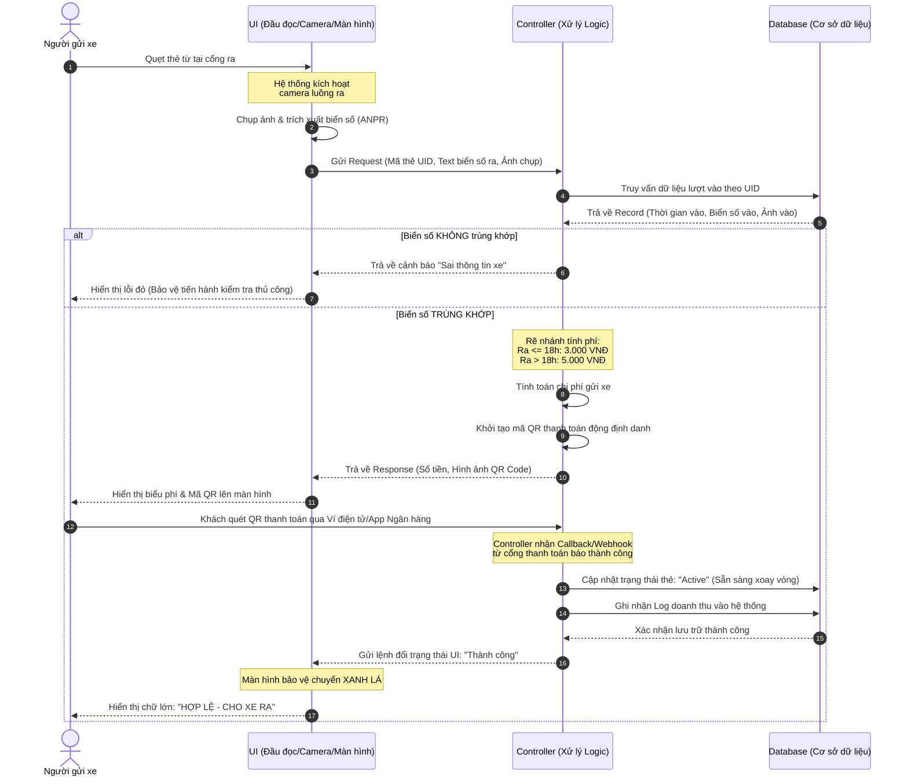

# Biểu đồ Tuần tự: Luồng quẹt thẻ và thanh toán xe ra

```mermaid
sequenceDiagram
    autonumber
    actor U as Người gửi xe
    participant UI as UI (Đầu đọc/Camera/Màn hình)
    participant C as Controller (Xử lý Logic)
    participant DB as Database (Cơ sở dữ liệu)

    U->>UI: Quẹt thẻ từ tại cổng ra
    Note over UI: Hệ thống kích hoạt<br/>camera luồng ra
    UI->>UI: Chụp ảnh & trích xuất biển số (ANPR)
    
    UI->>C: Gửi Request (Mã thẻ UID, Text biển số ra, Ảnh chụp)
    
    C->>DB: Truy vấn dữ liệu lượt vào theo UID
    DB-->>C: Trả về Record (Thời gian vào, Biển số vào, Ảnh vào)

    alt Biển số KHÔNG trùng khớp
        C-->>UI: Trả về cảnh báo "Sai thông tin xe"
        UI-->>U: Hiển thị lỗi đỏ (Bảo vệ tiến hành kiểm tra thủ công)
    else Biển số TRÙNG KHỚP
        Note over C: Rẽ nhánh tính phí:<br/>Ra <= 18h: 3.000 VNĐ<br/>Ra > 18h: 5.000 VNĐ
        C->>C: Tính toán chi phí gửi xe
        C->>C: Khởi tạo mã QR thanh toán động định danh
        
        C-->>UI: Trả về Response (Số tiền, Hình ảnh QR Code)
        UI-->>U: Hiển thị biểu phí & Mã QR lên màn hình
        
        U->>C: Khách quét QR thanh toán qua Ví điện tử/App Ngân hàng
        
        Note over C: Controller nhận Callback/Webhook<br/>từ cổng thanh toán báo thành công
        
        C->>DB: Cập nhật trạng thái thẻ: "Active" (Sẵn sàng xoay vòng)
        C->>DB: Ghi nhận Log doanh thu vào hệ thống
        DB-->>C: Xác nhận lưu trữ thành công
        
        C-->>UI: Gửi lệnh đổi trạng thái UI: "Thành công"
        Note over UI: Màn hình bảo vệ chuyển XANH LÁ
        UI-->>U: Hiển thị chữ lớn: "HỢP LỆ - CHO XE RA"
    end
```
